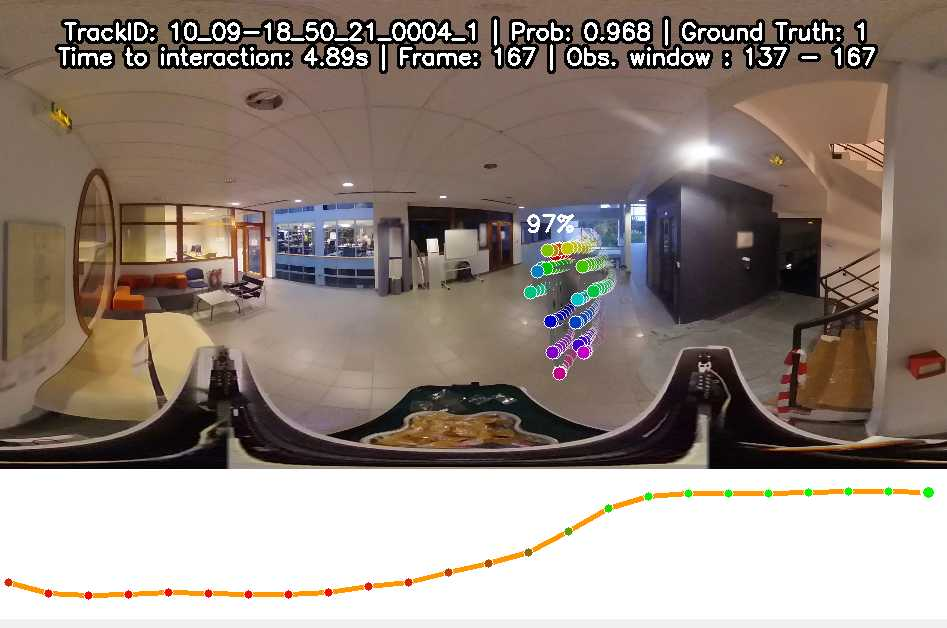

# HUI360 - Baselines

**Legacy** code for baselines of human-robot interaction anticipation on HUI360 dataset as presented in "HUI360: A dataset and baselines for Human Robot Interaction Anticipation" (FG2026).

TODO : Add tags, ArXiv, website, HF data (skeleton), HF data (videos) 

## Installation
Main dependencies are PyTorch for MLP and LSTM models, ScikitLearn for RandomForest classifiers and OpenCV-Python for visualization.

```
conda create --name huienv python=3.10
conda activate huienv
pip install -r requirements.txt
```

Hardware requirement are minimal, training and inference can be performed entirely on CPU or exploit GPU with less than 1GB VRAM.

The full skeleton dataset (~28GB) will be automatically downloaded using HuggingFace `snapshot_download` and placed in `datasets/hf_data` when running `training.py` or `infer.py`.

## Training
You can train using the light preprocessed HUI360-Train dataset and one of the 3 config files for RF, MLP or LSTM.

```
python training.py -ld -hp ./experiments/configs/expe_classifier/lstm_config.yaml --save_model
```

When launching training checkpoints will be saved in `experiments`

## Evaluation
You can evaluate the existing checkpoints (or the ones created during training) with the light preprocessed HUI360-Test dataset

```
python infer.py --model_path ./checkpoints/HUITrain_HUITest_LSTM/lstm_interaction_model_best_auc_anon.pth -ld
```

## Visualization


You can visualize the result of the prediction on a longer track using an updated prediction with a sliding window. Use `-sl` to control the total length you want to visualize.

```
python infer.py --model_path ./checkpoints/HUITrain_HUITest_LSTM/lstm_interaction_model_best_auc_anon.pth -d -chid -sl 250
```

Visualization is not possible for RF models.

## Dataset version
Note that experiments of the first HUI360 submission were done with the dataset at https://huggingface.co/datasets/rlorlou/HUI360 with commit 3c8a342548534b6b92d32b0099e266962facdf45


## Updated code for baselines
Please refer to the newer branches of this repository. Small updates on the data and code have been made. 