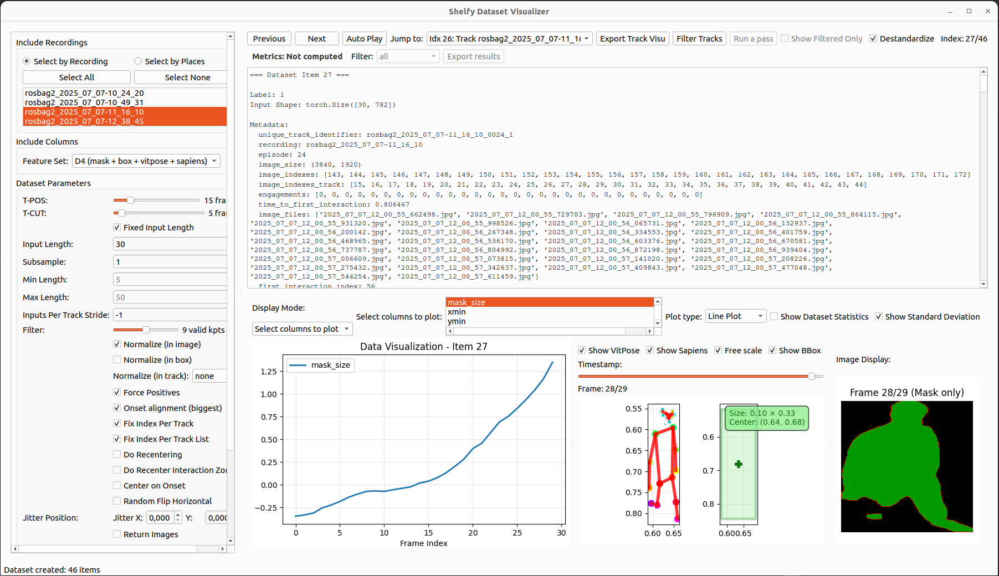

# HUI360 - Baselines

Code for baselines of human-robot interaction anticipation on HUI360 dataset as presented in "HUI360: A dataset and baselines for Human Robot Interaction Anticipation" (FG2026).

[](https://hal.science/view/index/docid/5609928)
[](https://arxiv.org/abs/TDB)
[](https://huggingface.co/datasets/rlorlou/HUI360)
[](https://github.com/RaphaelLorenzo/Interact360/)
[](https://hucebot.github.io/hui360/)

<!-- **Links:**
- Paper: https://hal.science/view/index/docid/5609928
- arXiv: https://arxiv.org/abs/TDB
- Data (HuggingFace): https://huggingface.co/datasets/rlorlou/HUI360
- Processing code: https://github.com/RaphaelLorenzo/Interact360/ -->

## Legacy baselines code
Please refer to the `legacy` branch of this repository for the results presented in the paper. Updates on the data and code have been made and new baselines have been added in this newer version. 

## Installation
Main dependencies are PyTorch and OpenCV-Python for visualization.

```
conda create --name huienv python=3.10
conda activate huienv
pip install -r requirements.txt
```

If you additionally want to use the interactive visualizer install PyQt6
```
PyQt6>=6.0.0
```

Hardware requirement are minimal, training and inference can be performed entirely on CPU or exploit GPU with less than 1GB VRAM.

The full skeleton dataset (~59GB) will be automatically downloaded using HuggingFace `snapshot_download` and placed in `datasets/hf_data` when running `training.py` or `infer.py`.

## Training
You can train a classifier using

```
python training.py -hp ./experiments/configs/in_hui/lstm_base.yaml --save_model
```

## Evaluation
You can evaluate the existing checkpoints (or the ones created during training)

```
python infer.py --model_path ./checkpoints/[SPLIT]/[MODELNAME].pth
```

A few checkpoints are provided you can download more [here](https://huggingface.co/buckets/rlorlou/hui360-baselines-checkpoints)

Configuration files to run evaluations are in `experiments/configs/[split]`
<details>

<summary>Detailed results on all splits</summary>

### Baselines (HUI)
Common to all models :
- 32 Frames Input (~2.1 second)
- Training and Validation cutoffs at 16 frames (~1.1 second)

You can find detailed WandB logs in `./experiments/logs`

#### For HUI (in dataset)
- #Validation Tracks : 407 total / 68 positives
- #Training Tracks : 1417 total / 135 positives

| Name                        | #Params (Trained) | AUC (Last)   | AUC (Best)   | AP (Last)    | AP (Best)    |
|-----------------------------|-------------------|--------------|--------------|--------------|--------------|
| LSTM                        | 0.37M             | 0.861        | 0.875        | 0.486        | 0.578        |
| MotionBERT (Head Only)      | 8.91M             | 0.821        | 0.842        | 0.492        | 0.544        |
| MotionBERT (Full FT)        | 51.4M             | 0.820        | 0.876        | 0.534        | 0.662        |
| MLP                         | 0.07M             | 0.856        | 0.859        | 0.476        | 0.545        |
| SkateFormer                 | 1.91M             | 0.781        | 0.838        | 0.362        | 0.540        |
| STG-NF                      | 0.07M             | 0.805        | 0.827        | 0.492        | 0.532        |
| ST-GCN                      | 3.07M             | 0.880        | 0.899        | 0.581        | 0.637        |


#### For SSUP-A (in dataset)
- #Validation Tracks : 4875 total / 148 positives
- #Training Tracks : 6098 total / 135 positives

| Name                        | #Params (Trained) | AUC (Last)   | AUC (Best)   | AP (Last)    | AP (Best)    |
|-----------------------------|-------------------|--------------|--------------|--------------|--------------|
| LSTM                        | 0.37M             | 0.897        | 0.908        | 0.230        | 0.268        |
| MotionBERT (Head Only)      | 8.91M             | 0.889        | 0.899        | 0.227        | 0.229        |
| MotionBERT (Full FT)        | 51.4M             | 0.863        | 0.904        | 0.269        | 0.269        |
| MLP                         | 0.07M             | 0.874        | 0.888        | 0.198        | 0.251        |
| SkateFormer                 | 1.91M             | 0.826        | 0.844        | 0.175        | 0.190        |
| STG-NF                      | 0.07M             | 0.758        | 0.782        | 0.082        | 0.099        |
| ST-GCN                      | 3.07M             | 0.868        | 0.882        | 0.213        | 0.246        |

#### For cross dataset evaluation (train on HUI, test on SSUP-A)
- #Validation Tracks : 4875 total / 148 positives
- #Training Tracks : 1417 total / 135 positives

| Name                        | #Params (Trained) | AUC (Last)   | AUC (Best)   | AP (Last)    | AP (Best)    |
|-----------------------------|-------------------|--------------|--------------|--------------|--------------|
| LSTM                        | 0.37M             | 0.757        | 0.797        | 0.106        | 0.134        |
| MotionBERT (Head Only)      | 8.91M             | 0.615        | 0.817        | 0.061        | 0.151        |
| MotionBERT (Full FT)        | 51.4M             | 0.670        | 0.728        | 0.075        | 0.122        |
| MLP                         | 0.07M             | 0.770        | 0.785        | 0.112        | 0.135        |
| SkateFormer                 | 1.91M             | 0.568        | 0.709        | 0.058        | 0.072        |
| STG-NF                      | 0.07M             | 0.573        | 0.609        | 0.043        | 0.051        |
| ST-GCN                      | 3.07M             | 0.688        | 0.732        | 0.056        | 0.104        |


#### For cross dataset evaluation (train on SSUP-A, test on HUI)
- #Validation Tracks : 407 total / 68 positives
- #Training Tracks : 6098 total / 135 positives

| Name                        | #Params (Trained) | AUC (Last)   | AUC (Best)   | AP (Last)    | AP (Best)    |
|-----------------------------|-------------------|--------------|--------------|--------------|--------------|
| LSTM                        | 0.37M             | 0.797        | 0.797        | 0.402        | 0.463        |
| MotionBERT (Head Only)      | 8.91M             | 0.686        | 0.746        | 0.359        | 0.406        |
| MotionBERT (Full FT)        | 51.4M             | 0.756        | 0.791        | 0.343        | 0.413        |
| MLP                         | 0.07M             | 0.778        | 0.802        | 0.463        | 0.491        |
| SkateFormer                 | 1.91M             | 0.732        | 0.752        | 0.430        | 0.453        |
| STG-NF                      | 0.07M             | 0.634        | 0.701        | 0.327        | 0.412        |
| ST-GCN                      | 3.07M             | 0.749        | 0.837        | 0.432        | 0.523        |

</details>


## Visualization

Visualization is possible with `dataset_visualizer.py`.

<details>
<summary>Using the interactive visualizer</summary>

**Instructions for visualization**



*Instruction 1 : play with it !*

*Additional explanations :*
- The tool automatically looks for data in `./datasets/hf_data` and may download the dataset if necessary
- You can select the recordings you want to open (tip : select only one for faster loading)
- You can set different preprocessing parameters such as the `T_CUT` and `T_POS` (rationale on the positive/negative samples)
- When ready click : `Create Dataset` (bottom left)
- Then when generating the visualizer makes use of `datasets/HUIDataset.py` to create a `Dataset` objects and you may see sample by sample the result (you will only see samples cropped to the desired length, not raw data with full tracks)
- You can pass a `--raw_data_path` if you have the raw video files to have them as background
- For some models and checkpoints you may use `Load Config From Checkpoint` or `Load Config And Model From Checkpoint` in order to load the exact same config used for training/inference, and you may visualize the inference results

</details>

## Citation

```
@article{TBD,
  author    = {Raphael Lorenzo-Louis and Fabio Amadio and Bertrand Luvison and Serena Ivaldi},
  title     = {HUI360: A dataset and baselines for Human Robot Interaction Anticipation},
  journal   = {TBD},
  year      = {2026},
}
```

## Acknoledgements
The code for the [SkateFormer](https://github.com/KAIST-VICLab/SkateFormer), [STG-NF](https://github.com/orhir/STG-NF), [ST-GCN](https://github.com/yysijie/st-gcn), [MotionBERT](https://github.com/Walter0807/MotionBERT) baselines were taken from their respective open-source implementation.

This work uses the amazing [SSUP-HRI](https://github.com/IRL-CT/SSUP-HRI) dataset from [Interaction Research Lab](https://irl.tech.cornell.edu/)